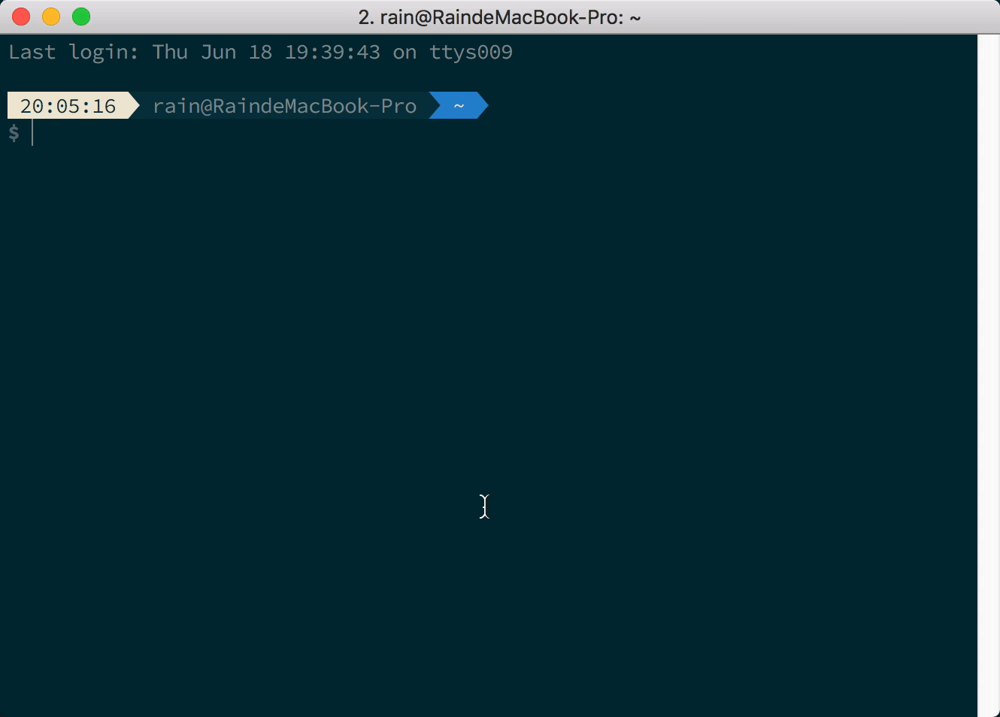
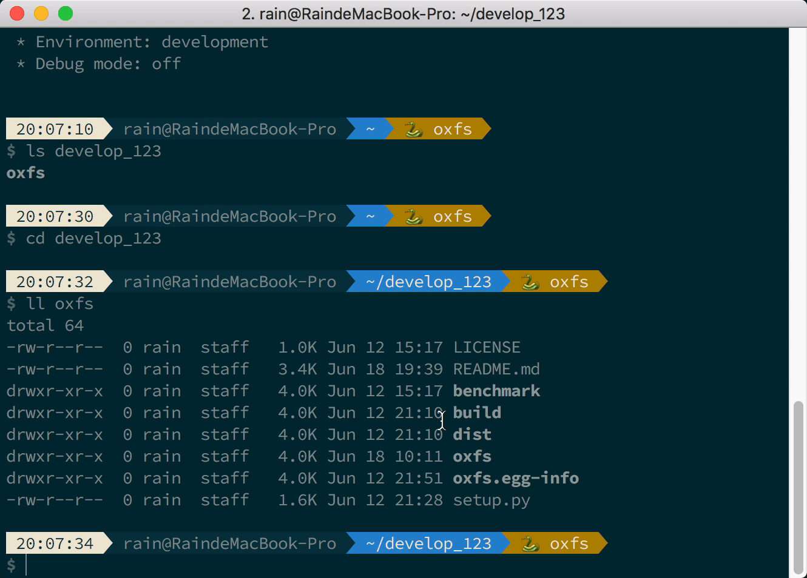

<p align="center">
<h1 align="center">oxfs</h1>
<h6 align="center">A dead simple, fast SFTP file system</h6>
</p>
<p align="center">


</p>

Oxfs is a user-space network file system similar to SSHFS, and the underlying data transfer is based on the SFTP protocol. Oxfs introduces an asynchronous refresh policy to solve the jamming problem caused by the mismatch between network speed and user operation file speed. When Oxfs writes a file, it first writes to the local cache file and submits an asynchronous update task to update the content to the remote host. Similarly, when reading a file, it is preferred to read from a local cache file. Oxfs's data cache eventually falls to disk, and even if it is remounted, the history cache can still be used.





## Get Started

### Install

- Ubuntu/Debian

```sh
$ sudo apt-get install fuse
# python >= 3.7
$ sudo apt-get install python3.8
$ python3.8 -m pip install oxfs
```

- MacOS
  - Please install osxfuse firstly. [links](https://github.com/osxfuse/osxfuse/releases)

```sh
$ brew install python3
$ mkdir ~/.venv
$ python3 -m venv ~/.venv/oxfs
$ source ~/.venv/oxfs/bin/activate
$ pip install oxfs
```

### Usage

```sh
# mount
$ oxfs --host mark@x.x.x.x --remote-path /home/mark --mount-point mark --cache-path ~/.oxfs --logging /tmp/oxfs.log --daemon --auto-cache

# browse & edit
$ cd mark

# umount
$ umount mark
```

### Help

```sh
$ oxfs -h
usage: oxfs [-h] [--host HOST] [--ssh-port SSH_PORT] [--cache-timeout CACHE_TIMEOUT] [--parallel PARALLEL] [--mount-point MOUNT_POINT] [--remote-path REMOTE_PATH]
            [--cache-path CACHE_PATH] [--logging LOGGING] [--daemon] [--auto-cache] [-v]

optional arguments:
  -h, --help            show this help message and exit
  --host HOST           ssh host (example: root@127.0.0.1)
  --ssh-port SSH_PORT   ssh port (defaut: 22)
  --cache-timeout CACHE_TIMEOUT
                        cache timeout (default: 30s)
  --parallel PARALLEL   parallel (default: equal to cpu count)
  --mount-point MOUNT_POINT
                        mount point
  --remote-path REMOTE_PATH
                        remote path (default: /)
  --cache-path CACHE_PATH
                        cache path
  --logging LOGGING     logging file
  --daemon              daemon
  --auto-cache          auto update cache
  -v, --verbose         debug info
```

## Benchmark

- sshfs: `fio -filename=fio20 -direct=1 -iodepth 1 -thread -rw=randread -rwmixread=70 -ioengine=psync -bs=4K -size=10M -numjobs=1 -runtime=100 -group_reporting -name=sshfs`
- read: IOPS=149, BW=599KiB/s (**613kB/s**)(10.0MiB/17093msec)

```sh

sshfs: (g=0): rw=randread, bs=(R) 4096B-4096B, (W) 4096B-4096B, (T) 4096B-4096B, ioengine=psync, iodepth=1
fio-3.29
Starting 1 thread
Jobs: 1 (f=1): [r(1)][100.0%][r=604KiB/s][r=151 IOPS][eta 00m:00s]
sshfs: (groupid=0, jobs=1): err= 0: pid=4611: Thu Mar 17 21:21:21 2022
  read: IOPS=149, BW=599KiB/s (613kB/s)(10.0MiB/17093msec)
    clat (usec): min=127, max=22361, avg=6663.51, stdev=862.88
     lat (usec): min=128, max=22362, avg=6664.35, stdev=862.90
    clat percentiles (usec):
     |  1.00th=[ 5604],  5.00th=[ 5800], 10.00th=[ 5997], 20.00th=[ 6194],
     | 30.00th=[ 6325], 40.00th=[ 6456], 50.00th=[ 6521], 60.00th=[ 6652],
     | 70.00th=[ 6849], 80.00th=[ 7046], 90.00th=[ 7439], 95.00th=[ 7898],
     | 99.00th=[ 8979], 99.50th=[ 9634], 99.90th=[15533], 99.95th=[20579],
     | 99.99th=[22414]
   bw (  KiB/s): min=  544, max=  624, per=99.65%, avg=597.85, stdev=16.06, samples=33
   iops        : min=  136, max=  156, avg=149.09, stdev= 4.06, samples=33
  lat (usec)   : 250=0.20%
  lat (msec)   : 2=0.04%, 10=99.45%, 20=0.23%, 50=0.08%
  cpu          : usr=0.36%, sys=1.57%, ctx=4977, majf=0, minf=26
  IO depths    : 1=100.0%, 2=0.0%, 4=0.0%, 8=0.0%, 16=0.0%, 32=0.0%, >=64=0.0%
     submit    : 0=0.0%, 4=100.0%, 8=0.0%, 16=0.0%, 32=0.0%, 64=0.0%, >=64=0.0%
     complete  : 0=0.0%, 4=100.0%, 8=0.0%, 16=0.0%, 32=0.0%, 64=0.0%, >=64=0.0%
     issued rwts: total=2560,0,0,0 short=0,0,0,0 dropped=0,0,0,0
     latency   : target=0, window=0, percentile=100.00%, depth=1

Run status group 0 (all jobs):
   READ: bw=599KiB/s (613kB/s), 599KiB/s-599KiB/s (613kB/s-613kB/s), io=10.0MiB (10.5MB), run=17093-17093msec
```

- oxfs(first read): `fio -filename=fio10 -direct=1 -iodepth 1 -thread -rw=randread -rwmixread=70 -ioengine=psync -bs=4K -size=10M -numjobs=1 -runtime=100 -group_reporting -name=oxfs`
- read: IOPS=1036, BW=4147KiB/s (**4247kB/s**)(10.0MiB/2469msec)

```sh
oxfs: (g=0): rw=randread, bs=(R) 4096B-4096B, (W) 4096B-4096B, (T) 4096B-4096B, ioengine=psync, iodepth=1
fio-3.29
Starting 1 thread
Jobs: 1 (f=1): [r(1)][8.3%][r=517KiB/s][r=129 IOPS][eta 00m:33s]
oxfs: (groupid=0, jobs=1): err= 0: pid=2307: Thu Mar 17 21:25:21 2022
  read: IOPS=1036, BW=4147KiB/s (4247kB/s)(10.0MiB/2469msec)
    clat (usec): min=188, max=259502, avg=960.96, stdev=10153.30
     lat (usec): min=188, max=259502, avg=961.26, stdev=10153.33
    clat percentiles (usec):
     |  1.00th=[   196],  5.00th=[   200], 10.00th=[   202], 20.00th=[   210],
     | 30.00th=[   217], 40.00th=[   219], 50.00th=[   223], 60.00th=[   231],
     | 70.00th=[   239], 80.00th=[   253], 90.00th=[   273], 95.00th=[   297],
     | 99.00th=[   529], 99.50th=[ 53740], 99.90th=[191890], 99.95th=[221250],
     | 99.99th=[258999]
   bw (  KiB/s): min=   15, max= 4798, per=29.71%, avg=1232.75, stdev=2377.03, samples=4
   iops        : min=    3, max= 1199, avg=307.50, stdev=594.38, samples=4
  lat (usec)   : 250=78.55%, 500=20.43%, 750=0.20%
  lat (msec)   : 20=0.04%, 50=0.27%, 100=0.23%, 250=0.23%, 500=0.04%
  cpu          : usr=0.57%, sys=2.84%, ctx=2878, majf=0, minf=14
  IO depths    : 1=100.0%, 2=0.0%, 4=0.0%, 8=0.0%, 16=0.0%, 32=0.0%, >=64=0.0%
     submit    : 0=0.0%, 4=100.0%, 8=0.0%, 16=0.0%, 32=0.0%, 64=0.0%, >=64=0.0%
     complete  : 0=0.0%, 4=100.0%, 8=0.0%, 16=0.0%, 32=0.0%, 64=0.0%, >=64=0.0%
     issued rwts: total=2560,0,0,0 short=0,0,0,0 dropped=0,0,0,0
     latency   : target=0, window=0, percentile=100.00%, depth=1

Run status group 0 (all jobs):
   READ: bw=4147KiB/s (4247kB/s), 4147KiB/s-4147KiB/s (4247kB/s-4247kB/s), io=10.0MiB (10.5MB), run=2469-2469msec
```

- oxfs(cached): `fio -filename=fio10 -direct=1 -iodepth 1 -thread -rw=randread -rwmixread=70 -ioengine=psync -bs=4K -size=10M -numjobs=1 -runtime=100 -group_reporting -name=oxfs-cached`
- read: IOPS=4224, BW=16.5MiB/s (**17.3MB/s**)(10.0MiB/606msec)

```sh
oxfs-cached: (g=0): rw=randread, bs=(R) 4096B-4096B, (W) 4096B-4096B, (T) 4096B-4096B, ioengine=psync, iodepth=1
fio-3.29
Starting 1 thread

oxfs-cached: (groupid=0, jobs=1): err= 0: pid=3075: Thu Mar 17 21:30:12 2022
  read: IOPS=4224, BW=16.5MiB/s (17.3MB/s)(10.0MiB/606msec)
    clat (usec): min=189, max=1055, avg=233.55, stdev=42.57
     lat (usec): min=189, max=1056, avg=233.81, stdev=42.61
    clat percentiles (usec):
     |  1.00th=[  194],  5.00th=[  200], 10.00th=[  204], 20.00th=[  215],
     | 30.00th=[  217], 40.00th=[  219], 50.00th=[  223], 60.00th=[  227],
     | 70.00th=[  237], 80.00th=[  249], 90.00th=[  269], 95.00th=[  293],
     | 99.00th=[  371], 99.50th=[  429], 99.90th=[  906], 99.95th=[  938],
     | 99.99th=[ 1057]
   bw (  KiB/s): min=17041, max=17041, per=100.00%, avg=17041.00, stdev= 0.00, samples=1
   iops        : min= 4260, max= 4260, avg=4260.00, stdev= 0.00, samples=1
  lat (usec)   : 250=80.82%, 500=18.95%, 750=0.12%, 1000=0.08%
  lat (msec)   : 2=0.04%
  cpu          : usr=1.82%, sys=10.25%, ctx=2671, majf=0, minf=9
  IO depths    : 1=100.0%, 2=0.0%, 4=0.0%, 8=0.0%, 16=0.0%, 32=0.0%, >=64=0.0%
     submit    : 0=0.0%, 4=100.0%, 8=0.0%, 16=0.0%, 32=0.0%, 64=0.0%, >=64=0.0%
     complete  : 0=0.0%, 4=100.0%, 8=0.0%, 16=0.0%, 32=0.0%, 64=0.0%, >=64=0.0%
     issued rwts: total=2560,0,0,0 short=0,0,0,0 dropped=0,0,0,0
     latency   : target=0, window=0, percentile=100.00%, depth=1

Run status group 0 (all jobs):
   READ: bw=16.5MiB/s (17.3MB/s), 16.5MiB/s-16.5MiB/s (17.3MB/s-17.3MB/s), io=10.0MiB (10.5MB), run=606-606msec
```

## Changelog

- release/0.5.0
  - [Improved] Add cache limit, lru policy.
  - [Removed] Delete ApiServer.
- release/0.4.0
  - [New] Add auto-cache policy to sync file automately.
- release/0.3.2
  - [New] Add user/password auth support.
  - [Improved] Add Config class, use subprocess.Popen.
- release/0.3.1
  - [Fixed] Fix no such file error when write occurred before read.
- release/0.3.0
  - [New] Add daemon support.
  - [New] Upgrade to flask-restx.
  - [Removed] Remove short argument.
  - [Fixed] Fix bugs with git operations.
  - [Fixed] Fix empty file write failed bug.
  - [Fixed] Fix mount permission issue.
- release/0.2.0
  - [New] Add restful API to refresh the cache.
- release/0.1.2
  - [Removed] Remove auto_unmount fuse parameter, some osxfuse do not support it.
  - [Deprecated] Disable the daemon parameter, turn on it in the future.
- release/0.1.1
  - [Added] enable the auto_cache by default.
- release/0.1.0
  - [Fixed] Fix the multi-thread bugs for rename operation.
